# campus-class-management-system

# 介绍
### 基于Java Web的校园班级综合管理系统

功能概述：所有功能基本上就这些；文档齐全

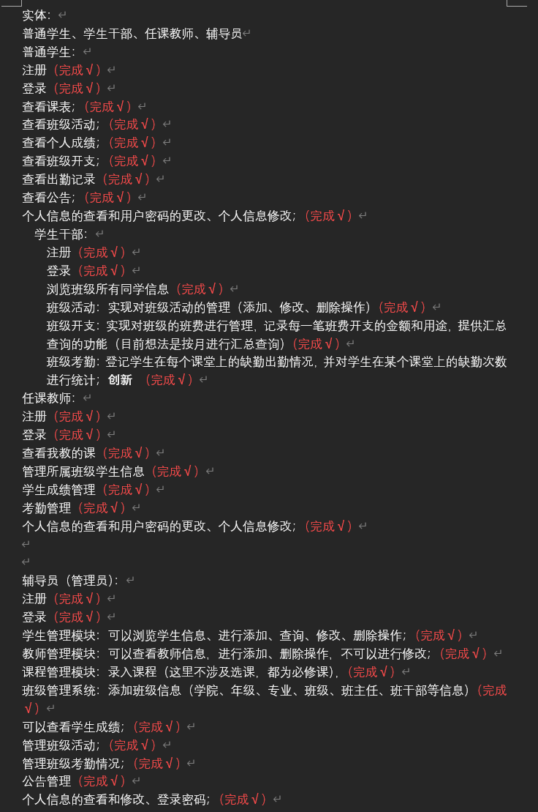

#### 软件架构
系统分为两个端，分别是Web客户端（多角色统一访问入口）、服务端；

Web客户端：使用HTML5、CSS3、JavaScript、jQuery、Ajax、Bootstrap、Layui实现（多角色自适应权限展示）

服务端：使用Java、Spring、SpringMVC、MyBatis实现

##### 用到的所有技术栈：
客户端：HTML5、CSS3、JavaScript、jQuery、Ajax、Bootstrap、Layui
服务端：Java JDK8、Spring、SpringMVC、MyBatis
数据库：MySQL 5.6+
服务器：Apache 2.0+（前端）、Tomcat 7.0+（后端）
工具：IDEA、HBuilderX、Navicat、Postman

#### 安装教程
1. 启动MySQL服务，新建数据库class_management_system，导入数据库文件gmss.sql
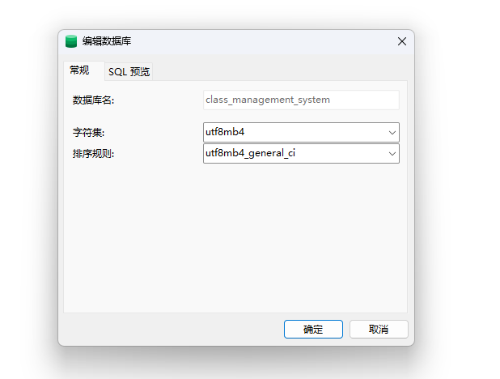

2. 启动服务端，在IDEA中打开ClassManagementServer，修改db.properties（或application.xml）文件中的数据库连接信息，配置Tomcat 7.0+运行环境，启动项目

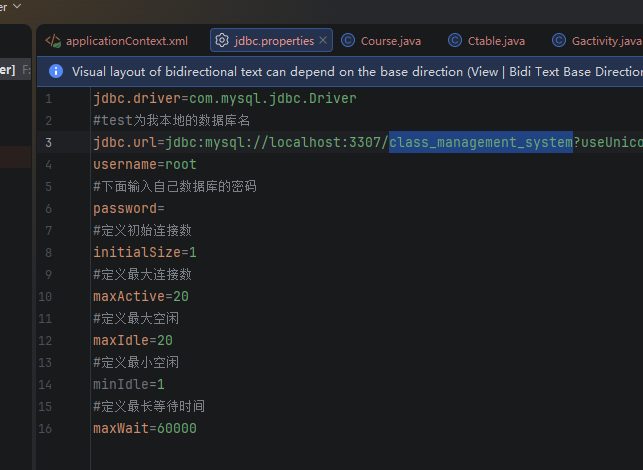

看到这个界面就是服务端启动成功了：
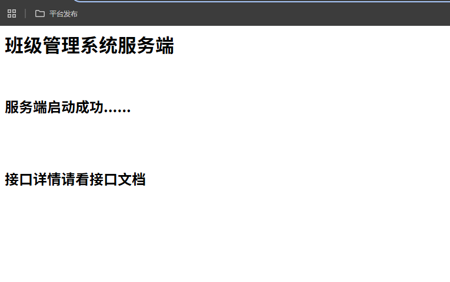

3. 启动前端页面，在HBuilderX中打开ClassManagementWeb；修改api/config.js中的服务器接口地址，配置Apache 2.0+ Web服务器，将前端文件部署到Apache根目录；打开登录页面

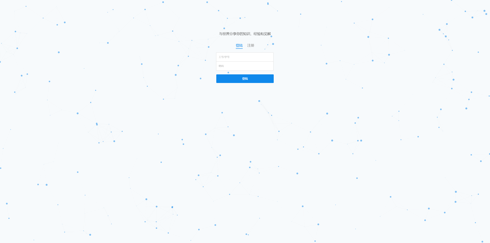

4. 测试不同角色登录：
    - 普通学生账号：可查看课表、成绩、考勤等
    - 学生干部账号：可管理班级活动、班费、考勤登记
    - 任课教师账号：可管理课程、学生成绩、考勤
    - 辅导员账号：可管理学生/教师信息、班级、公告等
      验证各角色功能正常使用，搭建完成
    系统内置特殊账号说明：
      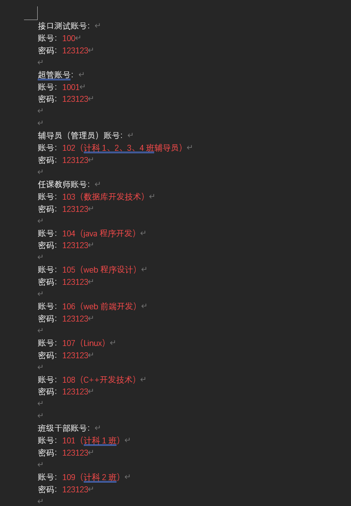

#### 效果图
普通学生端

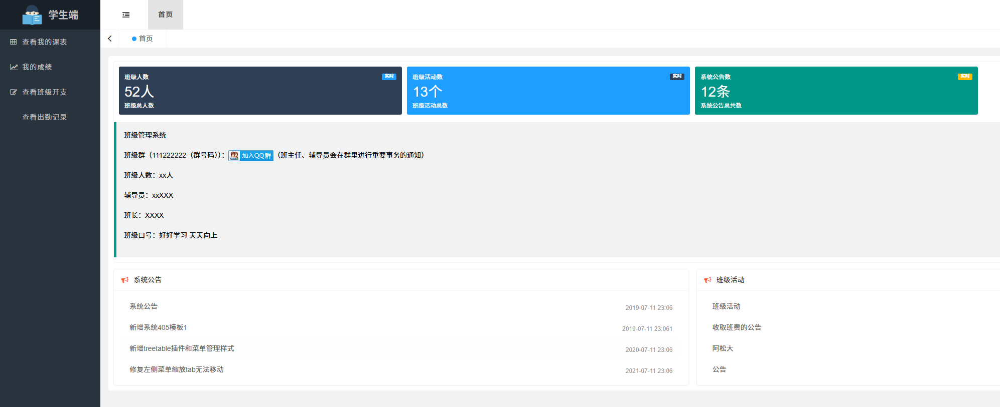
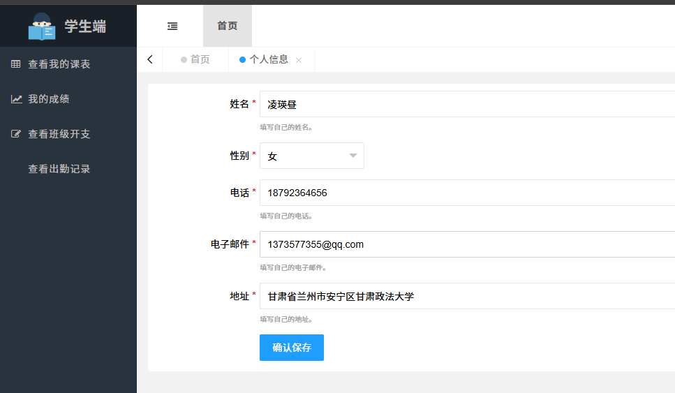
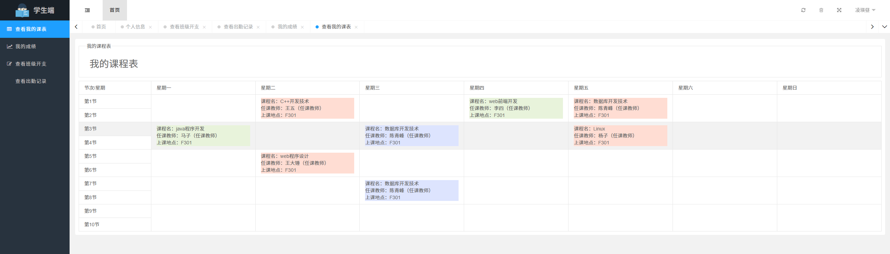
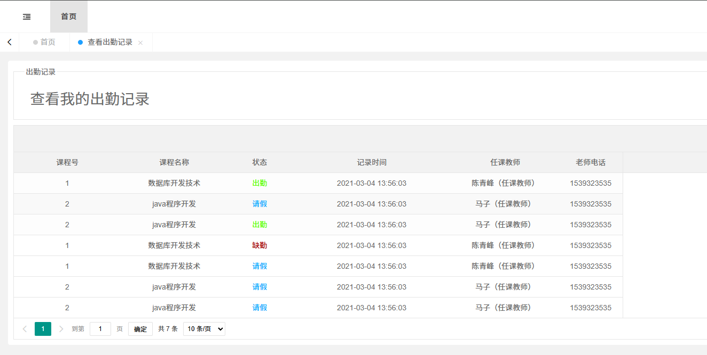

学生干部端
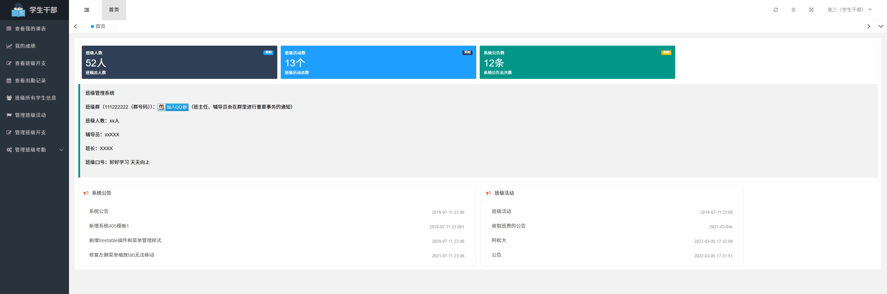
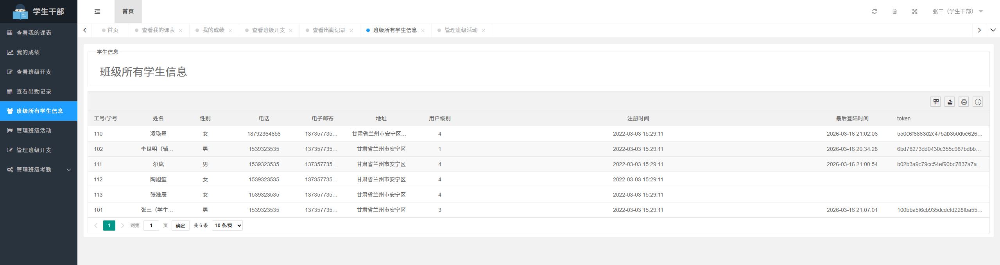
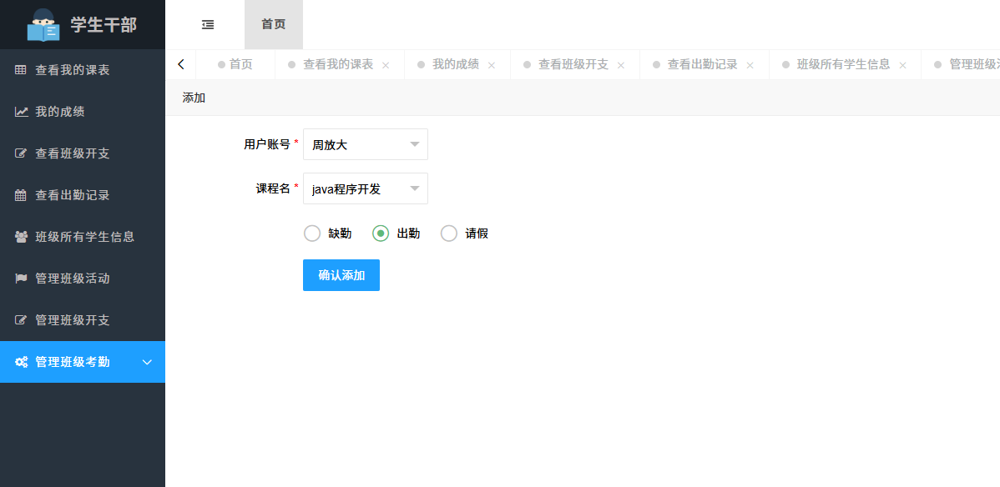
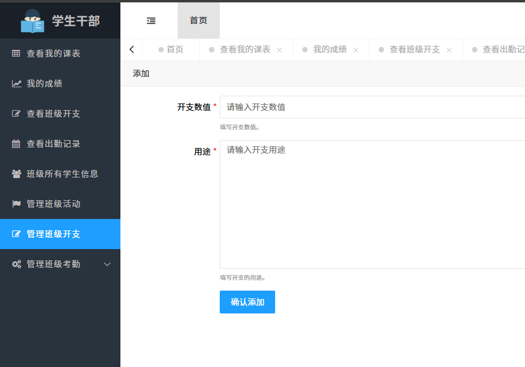
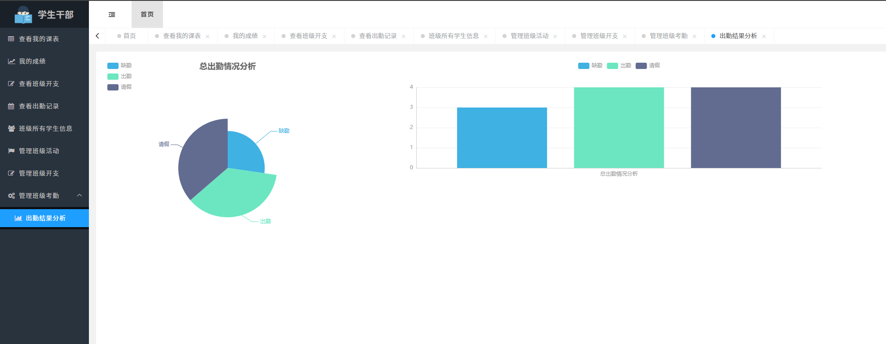

任课教师端
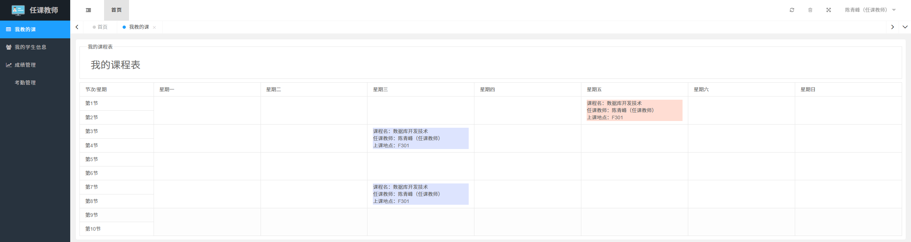
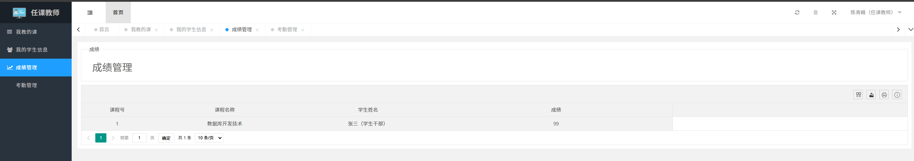

辅导员（管理员）端
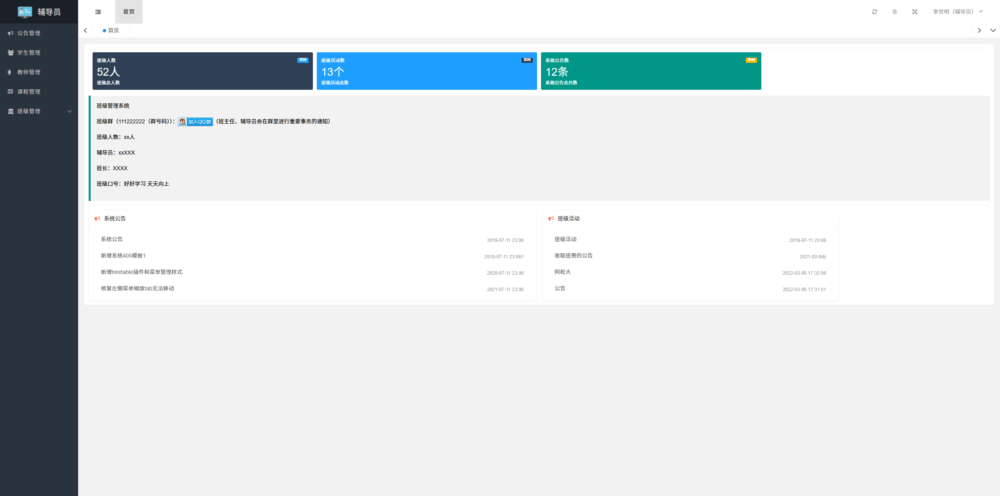
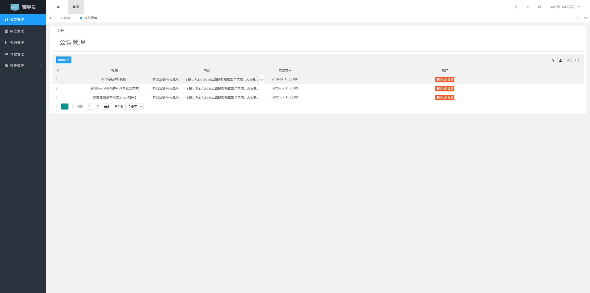
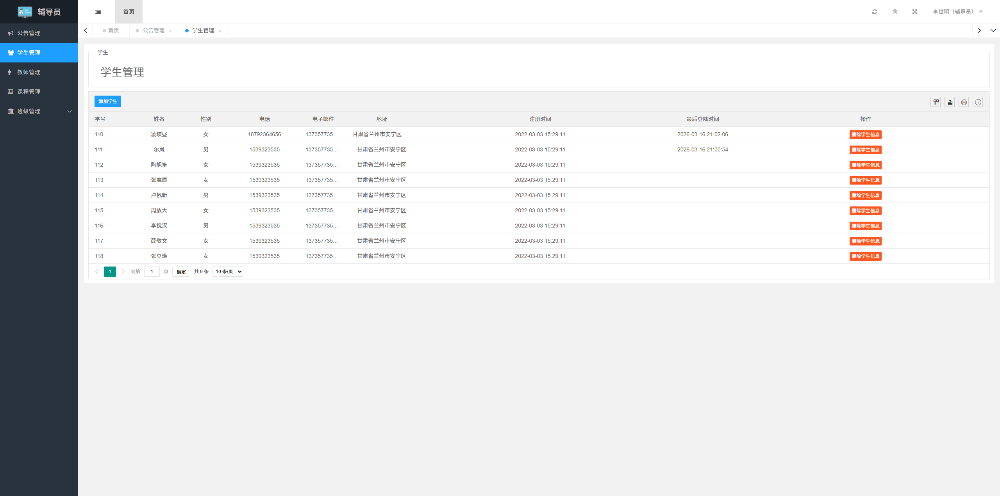
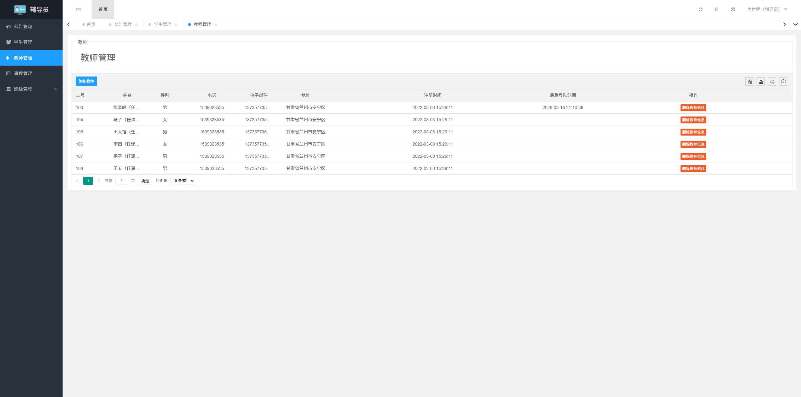
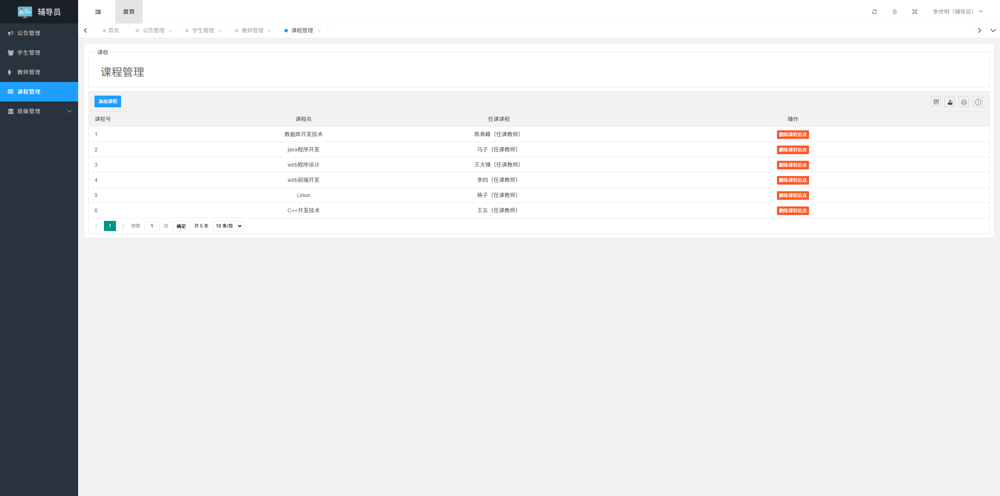
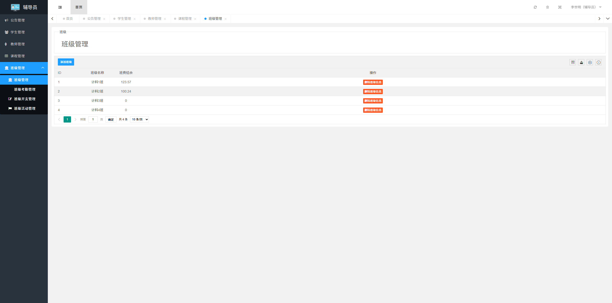
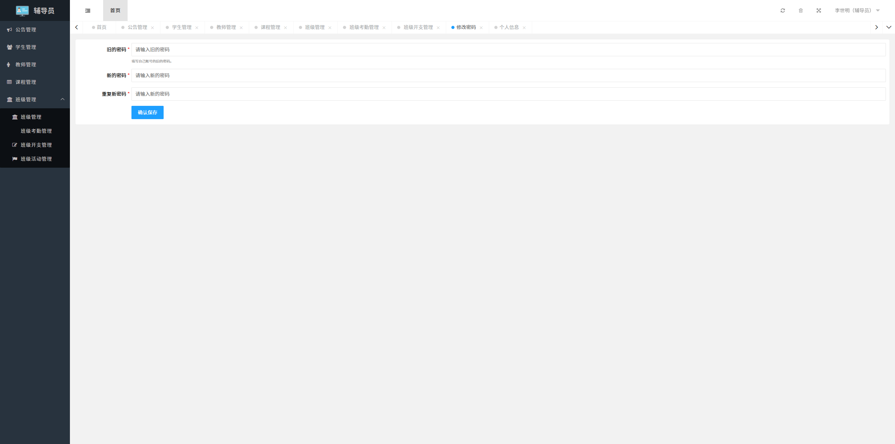

#### 写在最后
所有代码以及数据库全部开源，均为原创开发，如果觉得有用，麻烦点个star，谢谢！
**!!! 仅用于学习交流，请勿商用或者用于违法用途！**
如果部署搭建途中有任何问题随时可以联系我，我们也可以定制开发。

邮箱：1373577355@qq.com
wx：Awake778

#### ！！！技术支持收费，大家都时间珍贵，白嫖先生勿扰！！！！！！！！

# 技术支持
- 我们接所有项目定制开发、技术支持，有需要可以联系我，谢谢！
- 方案1：我这边按照需求开发完成，部署、简单讲解，后期有任何技术问题随时可以问。
- 方案2：跟着我做，我带着做，边做边讲，后期有任何技术问题随时问，小修改免费修改。

### 我们的技术栈：
#### 前端技术
- **Web开发**: VUE, Element, Bootstrap, LayUI, HTML5, CSS3, jQuery
- **微信小程序**: 原生开发, Taro
- **移动应用开发**:
    - Android（Java）
    - iOS（Swift）
- **跨平台开发**: uniapp

#### 后端技术
- **Java生态系统**:
    - 框架：Spring, SpringBoot, SpringMVC, SpringSecurity
    - 数据持久层：MyBatis, JPA
- **其他后端语言**: PHP, Python, Node.js

#### 数据库管理
- **关系型数据库**: MySQL, SQLServer, SQLite, Oracle
- **非关系型数据库**: MongoDB
- **缓存与搜索**: Redis, ElasticSearch

#### 服务器与部署
- **操作系统部署运维调试**: Linux, Windows
- **容器化与编排**: Docker部署, Kubernetes (k8s)部署
- **Web服务器配置**: Nginx, Apache, Tomcat, IIS
- **CI/CD与版本控制**: Jenkins部署, Git部署, SVN部署

#### 其他技术能力
- **数据分析**: 基于Java的分析工具, 基于Python的分析工具
- **爬虫开发**: 基于Java
- **自动化测试**: 接口测试（基于Java/Postman）, 自动化测试（基于Java）
- **自动化运维与监控**:
    - 自动化部署（基于Java）

# 项目TAG（标签）
## 中文标签
班级管理系统、校园管理系统、Java Web、SpringMVC、MyBatis、Layui、Bootstrap、MySQL、多角色权限、考勤管理、成绩管理、班费管理、班级活动、课表管理、公告管理、学生管理、教师管理、Apache、Tomcat、Postman

## 英文标签
campus-class-management-system、java-web、springmvc、mybatis、layui、bootstrap、mysql、multi-role-permissions、attendance-management、grade-management、class-fee-management、class-activities、timetable-management、announcement-management、student-management、teacher-management、apache、tomcat、postman